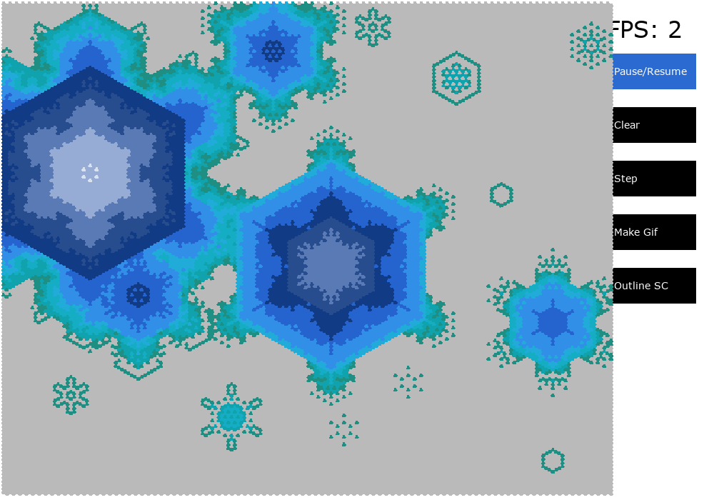
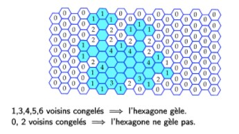
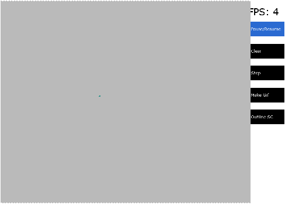
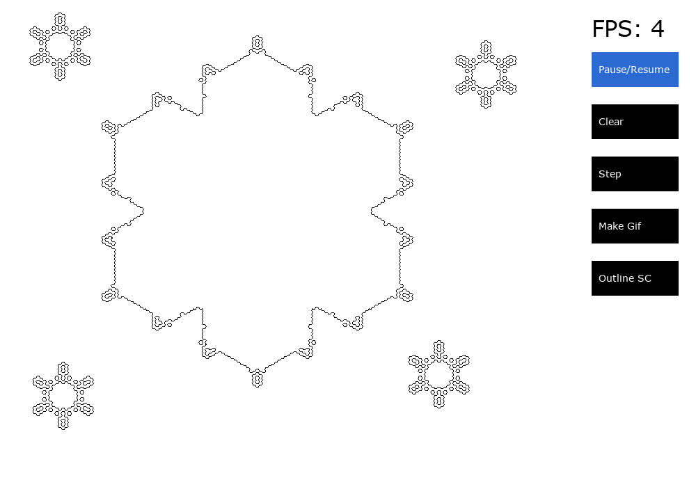
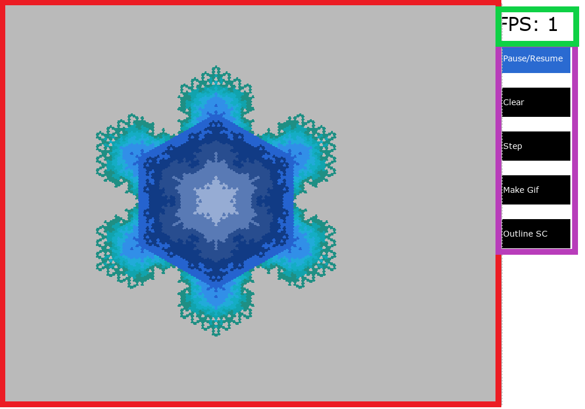
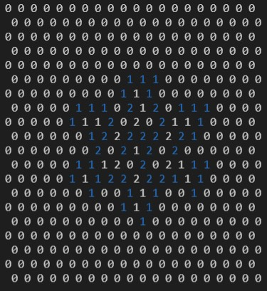

# Game of Hex

**A game of life clone that runs in a hexagonal grid!**


## Table of contents

- Features
- Setup
- How to use

## Features

#### Hexagonal game of life simulation

This is a game of life that runs on hexagonal grids to simulate crystal structures, like snowflakes.

- Custom board and grid management
- Cell types with easily changeable metadata (age, coordinates, state, etc.)
- Easily expandable and editable ruleset!

These are the rules built in:
<https://clairelommeblog.wordpress.com/category/apmep-journees-2020/>


Translates to:

- If there are 1,3,4,5 or 6 alive adjacent cells, the cell becomes alive on the next step.
- If there are 0 or 2 alive adjacent cells, the cell does not change.

#### UI

- Built in options for rendering in command line (unix and windows)
- Pygame user interface, with age based colouring to make pretty snowflakes!
- Easy to add new rendering methods.

#### GIFS

- Easy to make gifs (Pygame only) that make it easy to share your simulations with your friends.
- Also helps with showcasing larger boards that may be slow to run.


#### Laser cutting outlines

- One click to export outlines for laser cutting.



## Setup

You will need:

- Python 3.7.7 and higher but **lower than 3.10**.
- All the dependencies in requirements.txt. From the base path of this git, run `pip install -r requirements.txt` to install them all.

## How to use

Navigate to `src` and run `python main.py`. It should print some stuff about pygame then `---Game of Hex, starting!---`.

There are a couple command line arguements that you can use to change how it runs!

```optional arguments:
  -h, --help            show this help message and exit
  -x X                  Width of the grid
  -y Y                  Height of the grid
  -f MAXFPS, --maxfps MAXFPS     Maximum frames per seconds
  -r RADIUS, --radius RADIUS    Radius of the hexes (in pixels)
  -o, --outline     Only display hexagon structure outlines (laser cutting)
  -t THICKNESS, --thickness THICKNESS   Thickness of the outline lines (might be important for laser cutters.)
  --text                Use a text UI
  -l, --lines           Draw hexagon grid outline
  --resolution RESOLUTION RESOLUTION     Resolution of the window to open
  -p, --previous        Use previous settings
  ```

The first time you run the program, a `settings.json` file will be created. The below picture was taken with: `{"x": 190, "y": 135, "maxfps": null, "radius": 3, "text": false, "lines": false, "resolution": [1000, 700], "outline": false}`. This file is referenced when you use `-p`.

### Pygame UI

If you don't select `--text`, a Pygame window should open after a couple of seconds.



- The red part represents the "board". Click on it to place or remove cells.
- The purple part houses the buttons to control the simulation!
  - `Pause / Resume` pauses or resumes the simulation. When you start the program, it is paused. When playing, it runs the simulation as fast as it can.
  - `Clear` resets the board.
  - `Step` runs one step of the simulation at a time.
  - `Make a gif` saves a gif of everything that has happened since the last clear or the start. It gets saved to `src/img/gif`. They are **ready to share!**
  - `Outline SC` takes a screenshot of the outline of the alive cells (same as running `-o` but just for one frame.) The picture is saved to `src/img/outline`.
- The green part shows the framerate. When the board is paused this shows how many frames the drawing script can draw in a second and during simulation this is the number of simulation steps that can be run per second.

### Text display

If you use `--text`, you can't really interact with the with the simulation in real time. In `settings.py`, place the coordinates for cells that are to exist at the start in `startCells = []` (list of tuples).


The numbers in the cells represent the age of the cell and the colour represents it's state.
