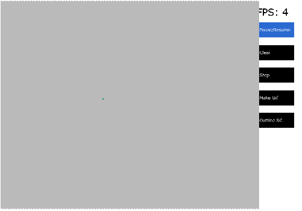
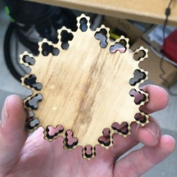
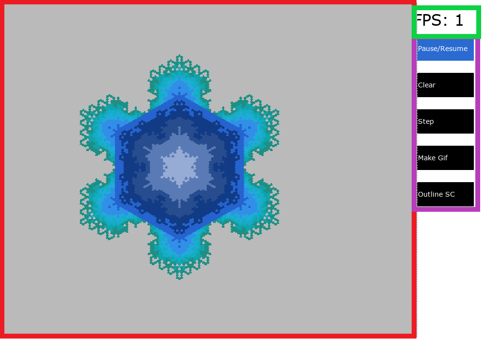

# Jeu des Hexagone

Read this document in [english](README.md).

**Un clone du "Jeu de la Vie de John Conway" qui utilise une grille hexagonale pour simuler les structures de cristaux et de flocons de neige!**


## Caractéristiques

### Simulation du Jeu de la Vie avec une grille hexagonale

Ce clone du Jeu de la Vie utilise une grille hexagonale pour simuler des structures de cristal telle que des flocons de neiges.

- Système de grille personnalisé avec gestion de la grille hexagonalle
- Meta-données des cellules modifiable (âge, coordonnées, état, etc.)
- Règles de simulation extensibles et personnalisables!

Les règles suivantes sont tirées de [ce site](https://clairelommeblog.wordpress.com/category/apmep-journees-2020/):  


Si l'argument `candie` est passé, alors les règles sont les suivantes:

- Avec 1, 3, 4, 5 ou 6 cellules vivantes adjacentes, la cellule devient (ou reste) vivante au prochain tour.
- Avec 0 ou 2 cellules vivantes adjacentes, la cellule meurt (dans le jeu de base, les cellules ne peuvent pas mourir).

### Interface Utilisateur

- Options de rendu dans la console (Unix et Windows)
- Interface graphique Pygame, avec une coloration basée sur l'âge pour rendre les flocons de neige jolis!
- Ajout de nouvelles méthodes de rendu facile!

#### Statistiques

- Visualizez certaines données telle que le nombre de cellules vivantes au cours du temps et l'âge moyen des cellules.

### GIFS

- Des GIFS facile à créer (Pygame seulement) pour partager vos simulations avec vos amis.
- Aussi, aide à la mise en valeur de grilles plus grandes qui peuvent être lentes à exécuter.



### Schéma pour découpe laser

- Un clique pour exporter le schéma pour découpe laser.




## Installation

Prérequis:

- Python 3.7.7 ou plus haut **mais plus petit que 3.10** (pour la compatibilité avec Pygame).
- Toutes les dépendances dans le fichier `requirements.txt`. Depuis le répertoire de base de ce git, exécutez `pip install -r requirements.txt`.

## Utilisation

Veulliez naviguer dans le répertoire `src` et exécuter `python main.py`. Il devrait afficher quelques choses sur pygame puis `---Game of Hex, starting!---`.

Il existe plusieurs options d'exécution:

```txt
  -h, --help            montre de l'aide
  -x X                  Épaisseur de la grille
  -y Y                  Hauteur de la grille
  -f MAXFPS, --maxfps MAXFPS    Images maximales par seconde
  -r RADIUS, --radius RADIUS    Rayon des hexagones (en pixels)
  -o, --outline     Afficher uniquement les contours de la structure hexagonale (découpe laser)
  -t THICKNESS, --thickness THICKNESS   Épaisseur des lignes de contour (peut être important pour les découpeuses au laser.)
  --text                Utiliser une interface de la console
  -l, --lines           Dessiner le contour de la grille hexagonale
  --resolution RESOLUTION RESOLUTION     Résolution de la fenêtre PyGame
  -p, --previous        Utiliser les paramètres précédents
```

La première fois que vous exécuterez le programme, un fichier `settings.json` sera créé. Vous pouvez le modifier à votre convenance et puis l'utiliser avec l'option `-p`.

### Interface Pygame

Si vous n'utilizer pas `--text`, une fenêtre Pygame s'ouvrira par défaut.



- En rouge il y a la grille, vous pouvez clicker dessus pour ajouter ou enlever des cellules.
- La partie magenta contient les boutons pour controller la simulation.
  - `Pause / Resume` pause ou continue la simulation. Lorsque vous commencez, la simulation est automatiquement en pause. Lorsque la simulation est en marche, elle ira aussi vite que possible.
  - `Clear` réinitialize la grille.
  - `Step` exécute une étape de la simulation.
  - `Make a gif` crée un gif de tous ce qui c'est passé depuis la dernière réinitialization. Le gif sera sauvegardé dans le répertoire `src/img/gif` **et sont près à être partagés!**
  - `Outline SC` prend une capture d'écran du schéma de la grille pour la coupe laser. Le schéma est sauvegardé dans le répertoire `src/img/outline`.
- La partie verte montre le nombre d'étapes par seconde de la simulation. Lorsque la simulation est en pause, elle montre le nombre d'étapes par seconde que la simulation peut faire.

### Interface textuelle

Si vous utiliser `--text`, vous ne pourrez pas vraiment interagir avec la simulation en vrai temps. A l'intérieur de `settings.py` vous pouvez placez les coordonées pour les cellules vivantes que vous voulez au début à l'intérieur de `startCells = []` (une liste tuples).


Les numéros représentent l'age de la cellule et la couleur représente son état.
